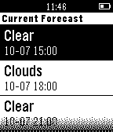
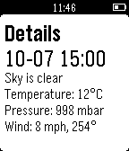

# Pebble.js Tutorial

Sample project from the Getting Started Pebble.js watchapp tutorials, showing how to use [Pebble.js](http://pebble.github.io/pebblejs/) to create a watchapp for displaying weather forecasts in a `Menu` object.

**Important**

To obtain weather information, you must supply a value for `myAPIKey` in 
`src/js/app.js`. These are freely available from
[OpenWeatherMap.org](https://openweathermap.org/appid).